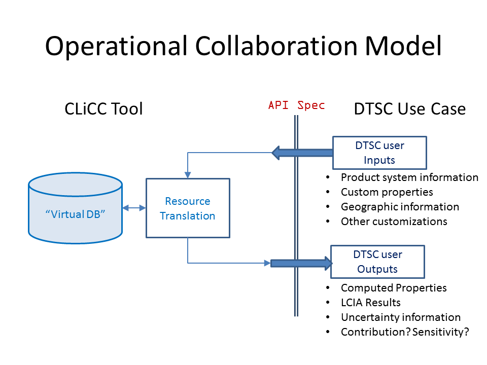

# CLICC-DTSC Integration Project

The purpose of this project is to prototype one possible form of remote
user interaction with the CLiCC database in order to obtain information in
a semi-automated way.

The project implements a web service in
[django](https://docs.djangoproject.com/en/1.8/) that exposes a basic
schema of chemical properties and LCIA results.

Note: To use the program you must create a secret key in the location
`/src/clicc_dtsc/secret_key.txt` and store your credentials in
`src/clicc_dtsc/db1_password.txt`.

